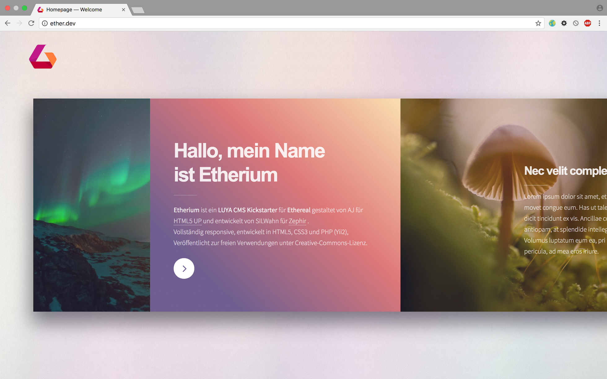

# ETHERIUM LUYA CMS KICKSTARTER

<em>Design perfomance meets architecture perfection.</em>
Free, flexible and fast Out-of-the-Box  Solution to kickstart your LUYA project.




## Features

* Complete CMS integration and easy extendability
* Full Admin control for all contents, images, sizes, color and layout behaviours
* Flexible and free sizable image gallery
* Multi language support
* Ready Contact form integration with validation
* SCSS and Gulp included
* Horizontally scrolling for desktop 
* Vertical scrolling for mobile view
* more ...


## Installation

#### 1.) Fork Repo or clone from Git:

```sh
git clone git@github.com:dev7ch/ether.git etherium
```

> This will clone this Repo to install the current dev-master of LUYA CMS and its modules.

#### 2.) Navigate to new created <b>project root</b> and run composer install

```sh

cd config/ &&
cp env.php.dist env.php &&
cp env-local-db.php.dist env-local-db.php 

```
Rename example DB in configs folder:

```sh

cp luya_etherium_demo.sql.dist luya_etherium_demo.sql.dist

```
Create empty database with for provided DB information and import example DB from '/config/luya_etherium_demo.sql'

#### 3.) Get all dependencies ready for setup`


```sh
composer install

``

> Get more help in [the LUYA CMS Install Guide](https://luya.io/guide/install).

#### 4.) Setup LUYA CMS

```sh

./vendor/bin/luya migrate
./vendor/bin/luya import

```

you could check the health of the cms system

```sh
./vendor/bin/luya health

```

#### 4.) Done! Login to your new Website

If all went fine and no error's shown in Terminal head over to your 
new Website, obviously 'http//localhost/etherium/public_html'


- <code> http://localhost/etherium/public_html </code>

- <code> http://localhost/etherium/public_html/admin </code>

Demo login credentials: <br />

User:  <code> demo@open.me </code> <br />
Password: <code> demo.open </code>


## Front-End

### Browser support

<b>Ethereal</b> is a modern, fully responsive theme completely written in FLEX designed by <a href="https://html5up.net">HTML5 UP</a>.  

### Libraries

These frontend libraries are included and available.

[» jQuery (yii\web\JqueryAsset)](http://www.yiiframework.com/doc-2.0/yii-web-jqueryasset.html)  
[» Fontawesome Icons](http://fontawesome.io/)  
[» Skell Responsive Framework](https://github.com/ajlkn/skel)  


### Compiling

We have created our own NPM Package that includes our gulp workflow.  
Inside the `resources/` folder, everything is prepared.

```sh
cd resources

npm install 
npm install gulp

```

See [zephir/zephir-gulp-workflow](https://github.com/zephir/zephir-gulp-workflow) for a full documentation of the workflow.

# Backend

### Assets

To speed up your local development you can uncomment the following lines in `configs/local.php` in order to use symlinking your assets instead of copy them every run.

```php
'assetManager' => [
    'class' => 'luya\web\AssetManager',
    'linkAssets' => true,
],
```

Now all assets will be symlinked and not copied.

> This will also enable CSS instant reload provided by `browserSync` (gulp).
